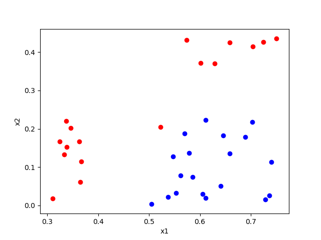
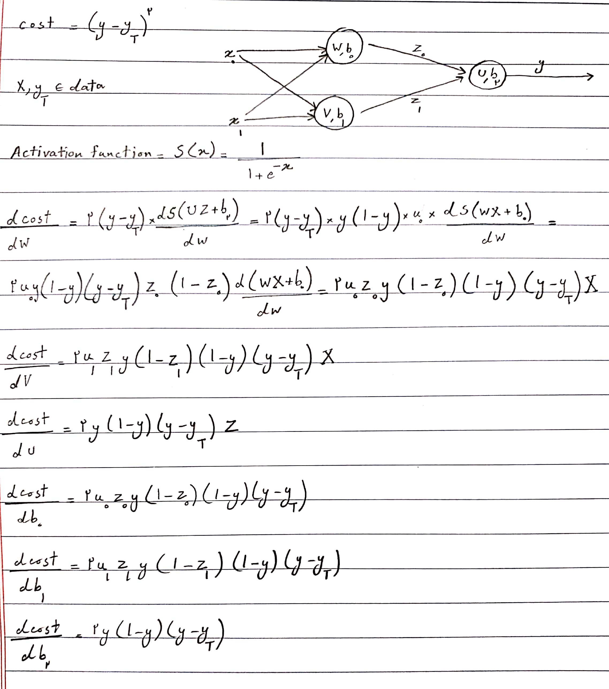
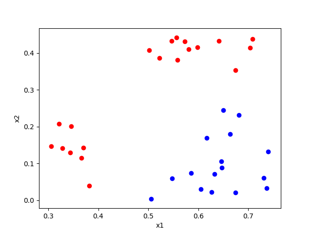

The aim of this homework is to know how perceptrons and neural networks work better, I'm going to report what I did  
step by step  

#### 1. Scattering data
First of all I want to scatter the data and show each group with a different color.  
This is what I got 
 
red color is used to show label 1 and blue is used to show 0 

#### 2. Splitting data
Then I splitted the data as 80% training and 20% test data

#### 3. Perceptron
In this part I want to implement a single perceptron, the cost function, the derivatives and the activation function I 
used are shown below  
 

#### 4. Train perceptron
Now the perceptron is trained by training data and then tested, the important thing to do in this part is to give  
appropriate number of epochs and learning rate to perceptron and to do so I had to examine different amounts and choose 
one at the end.

#### 5. Scattering test data
All the data we have is shown in part [1](#1-scattering-data), the image below is the result of the perceptron for test data  
(Keep in mind that this picture is just for one random run and it changes every time I run the code) 

#### 6. More layers
Up to now I have implemented a single perceptron, now it's time to have multiple of them together. What I want to  
implement and the derivations I need are shown below  

#### 7. Train neural network 
Just like part [4](#4-train-perceptron) I examined different learning rates and number of epochs and chose a relatively  
good one for both and then I tested the trained network like part [5](#5-scattering-test-data) 
