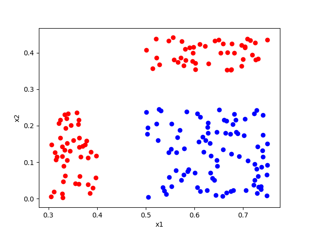

The aim of this homework is to know how perceptrons and neural networks work better, I'm going to report what I did  
step by step  

#### 1. Scattering data
First of all I want to scatter the data and show each group with a different color.  
This is what I got 

red color is used to show label 1 and blue is used to show 0 

