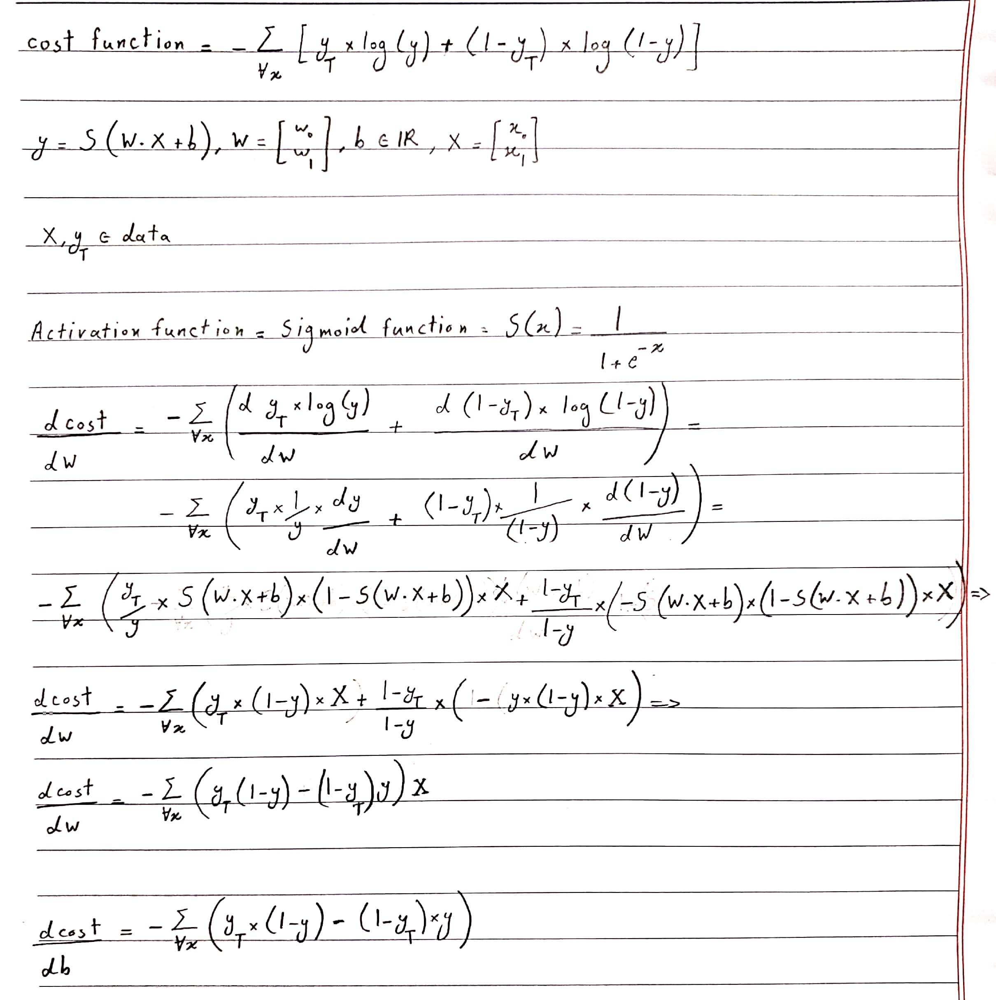

The aim of this homework is to know how perceptrons and neural networks work better, I'm going to report what I did  
step by step  

#### 1. Scattering data
First of all I want to scatter the data and show each group with a different color.  
This is what I got 
 
red color is used to show label 1 and blue is used to show 0 

#### 2. Splitting data
Then I splitted the data as 80% training and 20% test data

#### 3. Perceptron
In this part I want to implement a single perceptron, the cost function, the derivatives and the activation function I 
used are shown below  
 

#### 4. Train neural network
Now the perceptron is trained by training data and then tested, the important thing to do in this part is to give  
appropriate number of epochs and learning rate to perceptron 